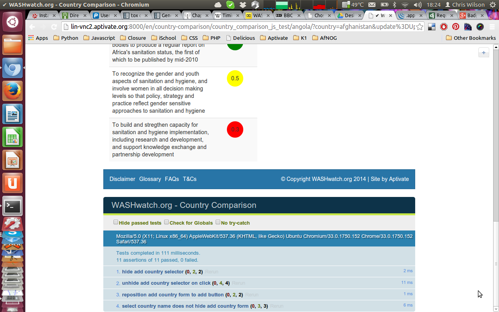

Javascript testing
------------------

* Status: proposal.

## Installation

### django.js

Install djangojs (pip_packages.txt):

    django.js==0.8.1

Enable the `djangojs` app in `settings.py`:

    THIRD_PARTY_APPS = (
        ...
        'djangojs',

(Note: `THIRD_PARTY_APPS` is used in [DYE](https://github.com/aptivate/dye) projects. If you don't have a `THIRD_PARTY_APPS` setting already, use `INSTALLED_APPS` instead.)

Also ensure that you have a suitable `DEBUG` variable which is not [reset to `False` while running tests](https://docs.djangoproject.com/en/dev/topics/testing/overview/#other-test-conditions):

    DJANGOJS_DEBUG = DEBUG
    
Enable `djangojs` views to be accessed through Django URL routing, but only when `DJANGOJS_DEBUG` is `True`, by adding the following lines to the global `urls.py`:

    if settings.DJANGOJS_DEBUG:
        urlpatterns += patterns('',
            url(r'^djangojs/', include('djangojs.urls')),
        )

### phantomjs

[phantomjs](http://phantomjs.org/) is a headless browser based on WebKit.
It renders HTML pages and executes JavaScript in memory, much the same as
the Chrome/Chromium browser, and allows you to automate running JavaScript
tests in a real browser environment.

Using phantomjs >= 1.9.7 is recommended because:

* phantomjs <= 1.4 requires an X server to be running, or you get a
  `cannot connect to X server` error (see [the FAQ](http://phantomjs.org/faq.html)).
  This is rather inconvenient for automated headless testing, and a waste
  of server resources.
* Older versions of phantomjs
  [fail to load modules using require.js](https://github.com/sheebz/phantom-proxy/issues/8),
  so the test runner doesn't work.

We built our own 
[phantomjs 1.9.7 RPM for CentOS 6 i386](http://rpm.aptivate.org/yum/centos/6/aptivate/i386/rpms/phantomjs-1.9.7-1.el6.i386.rpm)
which we installed on our Jenkins server. We used jbrauer's scripts to do this:

    git clone https://github.com/aptivate/phantomjs-rpms

On lin-vnc2 (Ubuntu 12.04 Precise) we installed from source as there was no
sufficiently recent Ubuntu package available.

## How it works

You derive your Python test classes from a Django-JS test base class (Js*TestCase) instead of TestCase, and mixin either JasmineSuite or QUnitSuite (we only cover QUnitSuite here).

When your Python test method runs, Django-JS does some setup and runs the PhantomJS browser with these parameters:

* A test runner (e.g. qunit-runner.js);
* A URL to an HTML page containing the JavaScript under test, a harness, and the JavaScript test cases;
* A timeout in seconds (optional).

The test runner redirects the browser's console logging to standard output (which DjangoJS collects and parses to find out whether the tests passed or failed), tells PhantomJS to exit when all tests have finished, and tells it to load the HTML page.

The actual setup depends on which test base class you use, which controls the HTML page that PhantomJS loads and runs:

* JsFileTestCase: static HTML file, already exists, no setup required.
* JsTemplateTestCase: template file, rendered and written to a temporary static HTML file.
* JsTestCase: live view, starts LiveServerTestCase to serve it.

## Testing strategies

### Static page testing

Doesn't require any Django - just running phantomjs on a static HTML file.

This is good for unit testing your JavaScript code in isolation. However you
will have to mock or fixture any data on the page that it interacts with,
AJAX services, Django translations and URL routing. The
[django_js template tag](http://djangojs.readthedocs.org/en/latest/templatetags.html#usage)
is not available, and so neither is the
[Django javascript module](http://djangojs.readthedocs.org/en/latest/djangojs.html)
that it provides.

To use this strategy, write your static HTML file, place it in your app, and derive your test class from  `JsFileTestCase`. For example:

    class QUnitTests(QunitSuite, JsFileTestCase):
        filename = os.path.join(os.path.dirname(__file__), 'tests', 'djangojs-tests.html')

Because it doesn't require any Django, you can just as easily run your tests from the command line:

    phantomjs .ve/lib/python2.7/site-packages/djangojs/phantomjs/qunit-runner.js myapp/tests/djangojs-tests.html

### Rendered template testing

Run on a template that djangojs will render and convert to a static HTML file.

This is good for unit testing as above, when your JavaScript code requires real (not mocked) access to information from Django, such as:

* Reverse and static URLs using the [Django javascript module](http://djangojs.readthedocs.org/en/latest/djangojs.html)

Since your template is not rendered by a view under your control, you cannot access:

* The current user from `Django.user` (there isn't one);
* Data from the database, generated by the view, forms, and Django settings (there's no way to get it into the rendering context).

As with static page testing, you'll need to fixture any such objects in your template, or provide mock replacements, or monkey patch your code to avoid accessing them.

To use this strategy, write your template, place it in your app, and derive your test class from  `JsTemplateTestCase`. For example:

    class QUnitTests(QunitSuite, JsTemplateTestCase):
        template_name = 'my/template.html'
        js_files = 'js/test/other/*.js'

Your template could well be derived from an existing template in your app, provided that it doesn't crash if it accesses variables (such as the current username) that are not defined in the rendering context. You should at least add the `` template tag somewhere in the page, and any mocks or fixtures that the code needs.

### Dynamic data testing

Run on a stand alone view that will use LiveServerTestCase to serve the view which
phantomjs will test against.

Django.JS provides some [base views](http://djangojs.readthedocs.org/en/latest/test.html#views) for javascript testing:

> Instead of writing a full view each time you need a Jasmine or a QUnit test view, simply use the provided JasmineView and QUnitView and add them to your test_urls.py.

This is similar to rendered template testing (a template is still required), but offers a few advantages:

* You can extend the view classes to add data to the context (and thus render it).
* Your JavaScript code can access web services provided by the Django application.

You still need to mock the behaviour of your real view, for example by placing the necessary objects into the context, and rendering them in the template.

To use this strategy, write your template as above, place it in your app, write a view if you need custom context variables (otherwise just use `QUnitView` directly):

    from djangojs.views import QUnitView
    
    class MyQUnitView(QUnitView):
        template_name = 'my-qunit-runner.html'
        js_files = (
            'js/lib/my-lib.js',
            'js/test/*.specs.js',
            'js/other/specs.*.js',
        )
        
        def get_context_data(self, **kwargs):
            context = super(MyQUnitView, self).get_context_data(**kwargs)
            context['form'] = TestForm()
            return context
        
Wire it into your app's `test_urls.py`:

    from django.conf.urls import patterns, url, include
    from djangojs.views import JasmineView, QUnitView
    from .tests import MyQUnitView
    
    urlpatterns = patterns('',
        url(r'^qunit$', MyQUnitView.as_view(name='my_qunit_view'),
    )

and derive your test class from  `JsTestCase`. For example:

    from djangojs.runners import JsTestCase, QUnitSuite
    
    class QUnitTests(QUnitSuite, JsTestCase):
        urls = 'myapp.test_urls'
        title = 'My QUnit suite'
        url_name = 'my_qunit_view'

### Modified view testing

Customise your own view to include extra djangojs information (integration testing).

This allows you to test your JavaScript code in an environment almost identical to the one provided by your real view, without having to mock the externally visible behaviour of your view.

The view that runs will be derived from your actual view. So you'll need to setup the database, current user, etc. just as you do when testing your view's server-side behaviour. 

We do this by mixing `QUnitView` from Django.JS into your view. See the example below for details.

## Modified view testing example

### Python view `<app>/tests.py`

    class CountryComparisonJsTestView(CountryComparison, QUnitView):
        template_name = 'country_comparison/test.html'
        django_js = True
        js_files = ['js/country_comparison_tests.js']

Note that we change the template that our `CountryComparison` view normally renders. The `test.html` template extends the normal one, but adds the `django_js` template tag and fixtures (see the example below)

JavaScript files listed in the `js_files` class variable will be loaded by the `django_js` template tag. 

The Django.JS view classes are not designed to be mixed in with other views, so we need to modify `get_context_data` to combine the context variables from `QUnitView` with the ones from our view, `CountryComparison`:

        def get_context_data(self, **kwargs):
            kwargs.update(QUnitView.get_context_data(self))
            return super(CountryComparisonJsTestView, self).get_context_data(**kwargs)

### Urls `<app>/urls.py`

    if settings.DJANGOJS_DEBUG:
        from .tests import CountryComparisonJsTestView
        urlpatterns += patterns('',
            url(r'^country_comparison_js_test/(?P<slug>\S+)/$',
                CountryComparisonJsTestView.as_view(),
                name="country_comparison_js_test"),
        )

Add a custom URL pattern for manually accessing the test page in a browser
(under runserver). This is useful for debugging the tests.

### Template `<apps>/templates/country_comparison/test.html`

    

Extend the template normally used by your view to include the extra information
needed to run the tests.

    
        {{ block.super }}
        <link rel="stylesheet" href="http://code.jquery.com/qunit/qunit-1.14.0.css" type="text/css" media="screen">  
    

Include the QUnit styles so it looks pretty.

    

    
        {{ block.super }}

        
          
        

Loads and initialises the [Django javascript module](http://djangojs.readthedocs.org/en/latest/djangojs.html), which allows JavaScript to:

* access Django CSRF tokens to authenticate forPOST requests;
* resolve Django named URLs and static files.

Django.JS loads jQuery by default to help tests, but we disable it because:

* our base template already loads jQuip;
* we want to test our app against jQuip instead of jQuery, because that's what it will use in real life;
* loading both jQuery and jQuip confuses and breaks some libraries that extend jQuery (or jQuip).

We do this by adding `jquery=false` to the `django_js` template tag.

        


        

Loads the QUnit testing framework libs.

        
        
        

Loads the JavaScript libraries under test (the `js_files` defined in our View).

    

### JavaScript tests `<app>/static/js/country_comparison_tests.js`

    test('hide add country selector', function() { 
        var forms = $('._country_add_form');
        ok(forms.length == 1, "Expect only one form");
        equal(forms.css('display'), 'none',
            "Expect the add form to be hidden initially");
    }); 

An example JavaScript test using the QUnit framework, showing the basic QUnit
assertions `ok` and `equal`. [See QUnit documentation](https://api.qunitjs.com/category/assert/)

### Django JavaScript integration `<app>/tests.py`

    from djangojs.runners import JsTestCase, QUnitSuite

    @override_settings(ROOT_URLCONF="country_comparison.test_urls",
        DEBUG_PROPAGATE_EXCEPTIONS=True)
    class CountryComparisonJsTests(CountryComparisonTestMixin, QUnitSuite,
            JsTestCase):

        url_name = 'country_comparison_js_test'
        url_kwargs = {'slug': 'zambia'}

This is what points phantomjs to the correct view you want it to load and run
tests from, ie. The test view we defined earlier.

As we're testing a page generated by a DjangoCMS app, we can only access that
page by either creating a page in the database, or overriding the urls.py to
attach the app URLs to a specific prefix. We do the latter with
@override_settings as it is more efficient.

## Running JavaScript tests

### Using Django integration

    ./manage.py test ...

The standard test runner will start and run phantomjs to execute JavaScript
tests.

### Run phantomjs manually

     phantomjs .ve/local/lib/python2.7/site-packages/djangojs/phantomjs/qunit-runner.js http://localhost:8000/en/countries/country_comparison_js_test/zambia/

Expected test run output:

    ok 1 - Expect only one form
    ok 2 - Expect the add form to be hidden initially     
    ...

### How to get run tests against a static copy of a page

    wget http://localhost:8000/en/countries/country_comparison_js_test/angola/ -k -O /tmp/angola.html

`wget -k` rewrites relative URLS so phantomjs will be able to load referenced the
resources. The rewritten URLs will refer to `http://localhost:8000/`, so you will
need `manage.py runserver` running when you start `phantomjs` to actually serve any
such resources.

    phantomjs .ve/local/lib/python2.7/site-packages/djangojs/phantomjs/qunit-runner.js /tmp/angola.html

### Run tests in browser and see results in page

    http://localhost:8000/en/countries/country_comparison_js_test/zambia/

Visit the test URL in browser and look for QUnit data in the page (`
`)

You can see from the screenshot how the QUnit test results appear at the bottom
of what is otherwise the normal page rendered by your view.
